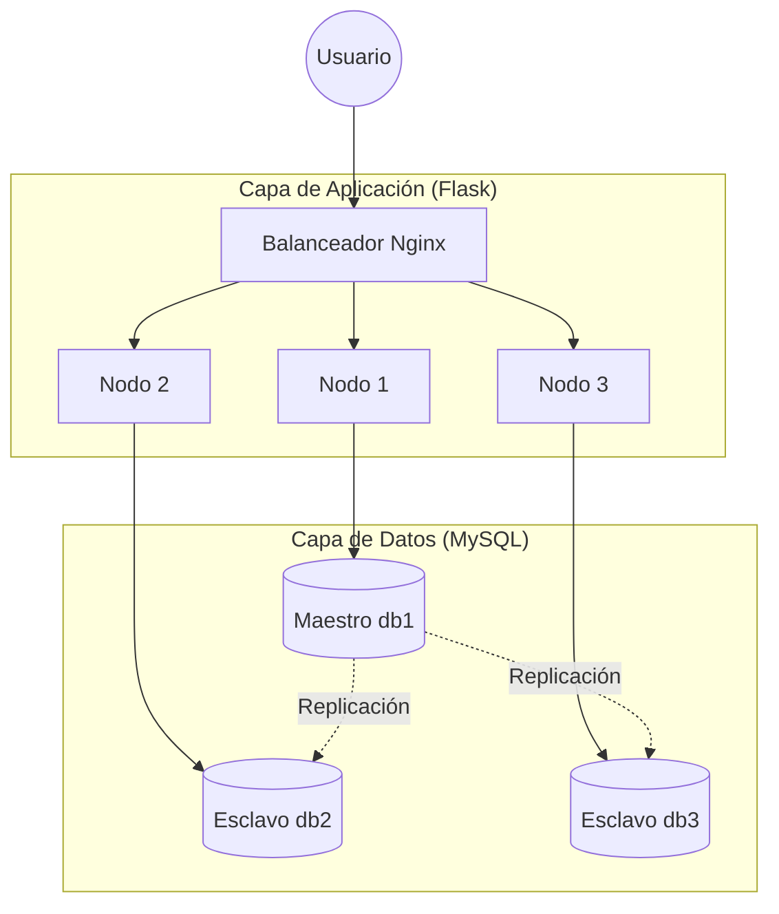
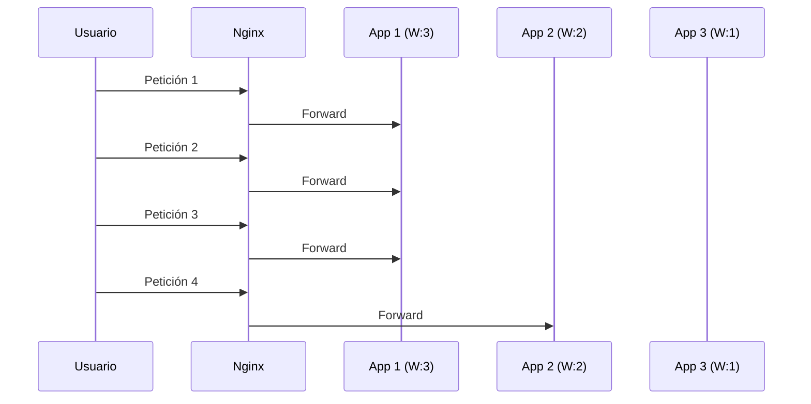

# Sistema de Gestión de Salas - Arquitectura Distribuida (3 Nodos)

Esta es una aplicación web de alta disponibilidad desarrollada con Flask, orquestada mediante Docker Compose y balanceada con Nginx. Implementa una arquitectura distribuida con replicación de base de datos Master-Slave (1 Maestro y 2 Esclavos).

**Índice**

1. [Arquitectura del Sistema](#arquitectura-del-sistema)
2. [Estructura del Proyecto](#estructura-del-proyecto)
3. [Despliegue y Ejecución](#despliegue-y-ejecución)
4. [Estrategia de Balanceo de Carga](#estrategia-de-balanceo-de-carga)
5. [Acceso a los Nodos y Servicios](#acceso-a-los-nodos-y-servicios)
6. [Configuración de Replicación MySQL](#configuración-de-replicación-mysql)
7. [Esquema de Base de Datos](#esquema-de-base-de-datos)
8. [Rutas de la Aplicación](#rutas-de-la-aplicación)
9. [Seguridad y Configuración](#seguridad-y-configuración)
10. [Monitoreo y Salud](#monitoreo-y-salud)
11. [Pruebas de Balanceo](#pruebas-de-balanceo)
12. [Guía de Desarrollo](#guía-de-desarrollo)
13. [Solución de Problemas](#solución-de-problemas)
14. [Comandos Útiles de Mantenimiento](#comandos-útiles-de-mantenimiento)

---

## Arquitectura del Sistema

El sistema implementa un modelo de **N capas distribuido** diseñado para escalabilidad y tolerancia a fallos.



### Stack Tecnológico

- **Frontend:** HTML5, CSS3 (Vanilla), JavaScript, Jinja2.
- **Backend:** Flask (Python 3.9), PyMySQL.
- **Infraestructura:** Docker, Docker Compose, Nginx.
- **Base de Datos:** MySQL 8.0.

---

## Estructura del Proyecto

```plaintext
Proyecto_final_AD/
├── app/                  # Microservicio Flask
│   ├── models/           # Definición de tablas y lógica de datos
│   ├── routes/           # Endpoints de autenticación y salas
│   ├── static/           # Archivos CSS y JS
│   └── templates/        # Vistas HTML (Jinja2)
├── nginx/                # Configuración del Proxy Inverso
├── sql/                  # Scripts de inicialización de BD
├── data/mysql/           # Persistencia de datos (Volúmenes)
├── test_balances.py      # Script de pruebas de carga
└── docker-compose.yml    # Orquestador de contenedores
```

---

## Despliegue y Ejecución

### Requisitos

- Docker y Docker Compose (V2 recomendado).

### Inicio Rápido

```bash
# 1. Limpiar entornos previos y levantar contenedores
docker-compose down -v --remove-orphans
docker-compose up -d --build

# 2. Verificar que los 10 servicios estén activos
docker-compose ps
```

---

## Estrategia de Balanceo de Carga

Nginx utiliza **Round Robin con Pesos** para optimizar la carga según la capacidad de los nodos:

| Nodo      | Peso | Tráfico Estimado |
| :-------- | :--- | :--------------- |
| **App 1** | `3`  | 50%              |
| **App 2** | `2`  | 33%              |
| **App 3** | `1`  | 17%              |



---

## Acceso a los Nodos y Servicios

| Nodo            | Servicio         | URL Externa                                    | Acceso DB (Interno) |
| :-------------- | :--------------- | :--------------------------------------------- | :------------------ |
| **Balanceador** | Punto de Entrada | [http://localhost:8084](http://localhost:8084) | -                   |
| **Nodo 1**      | Maestro (db1)    | [http://localhost:5000](http://localhost:5000) | Port: 3308          |
| **Nodo 2**      | Esclavo (db2)    | [http://localhost:5001](http://localhost:5001) | Port: 3309          |
| **Nodo 3**      | Esclavo (db3)    | [http://localhost:5002](http://localhost:5002) | Port: 3310          |

---

## Configuración de Replicación MySQL

La replicación se basa en el registro de binlogs del maestro.

### 1. Obtención de Coordenadas (Maestro - db1)

```sql
-- Ejecutar en db1 (Master)
SHOW MASTER STATUS;
```

_Toma nota de **File** y **Position**._

### 2. Configuración de Esclavos (db2 y db3)

```sql
-- Ejecutar en db2 y db3 (Slaves)
STOP SLAVE;
CHANGE MASTER TO
  MASTER_HOST='db1',
  MASTER_USER='repl',
  MASTER_PASSWORD='repl123',
  MASTER_LOG_FILE='mysql-bin.000003', -- Valor real
  MASTER_LOG_POS=157;                -- Valor real
START SLAVE;
```

---

## Esquema de Base de Datos

El sistema utiliza dos tablas principales relacionadas:

### Tabla `usuarios`

| Campo      | Tipo     | Descripción                          |
| :--------- | :------- | :----------------------------------- |
| `id`       | INT (PK) | Identificador único autoincremental. |
| `username` | VARCHAR  | Nombre de usuario único.             |
| `email`    | VARCHAR  | Correo electrónico único.            |
| `password` | VARCHAR  | Hash de la contraseña.               |

### Tabla `salas`

| Campo       | Tipo     | Descripción                     |
| :---------- | :------- | :------------------------------ |
| `id`        | INT (PK) | Identificador único de la sala. |
| `nombre`    | VARCHAR  | Nombre descriptivo.             |
| `codigo`    | VARCHAR  | Código único de acceso.         |
| `capacidad` | INT      | Aforo máximo.                   |
| `userid`    | INT (FK) | ID del usuario creador.         |

---

## Rutas de la Aplicación

### Frontend

- `/login`: Autenticación de usuarios.
- `/register`: Creación de cuentas.
- `/dashboard`: Panel de control principal.

### API REST

- `POST /auth/login`: Inicia sesión.
- `POST /sala/create`: Crea una sala (Escritura en Maestro).
- `GET /sala/all`: Obtiene todas las salas (Lectura desde el nodo actual).

---

## Seguridad y Configuración

- **Sesiones:** Manejadas mediante cookies firmadas con `SECRET_KEY`.
- **Contraseñas:** Almacenadas con hashing (Werkzeug/Bcrypt).
- **Aislamiento:** Red Docker interna `app_network` para evitar exposición directa de las bases de datos.

---

## Monitoreo y Salud

Puedes verificar el estado de cualquier nodo mediante:
`GET http://localhost:8084/api/status`

---

## Pruebas de Balanceo

Se incluye un script `test_balances.py` para verificar la distribución de carga:

```bash
python test_balances.py
```

**Resultado esperado:** Una distribución cercana al 50% para el Nodo 1, 33% para el Nodo 2 y 17% para el Nodo 3.

---

## Guía de Desarrollo

### Agregar un nuevo Modelo

1. Crea el archivo en `app/models/`.
2. Define la clase y los métodos de interacción con `get_db()`.
3. Importa y usa el modelo en las rutas correspondientes.

### Modificar el Balanceo

Edita `nginx/nginx.conf` y ajusta los valores de `weight` en el bloque `upstream`.

---

## Solución de Problemas

- **Contenedores no inician:** Asegúrate de que los puertos 8084, 5000-5002 y 3308-3310 estén libres.
- **Fallo de Replicación:** Verifica que el `MASTER_LOG_POS` sea el correcto ejecutando `SHOW MASTER STATUS` en db1.
- **Error de Conexión DB:** Revisa que las variables de entorno en `docker-compose.yml` coincidan con las credenciales de MySQL.

---

## Comandos Útiles de Mantenimiento

```bash
docker-compose logs -f nginx   # Ver logs del balanceador
docker-compose restart app1    # Reiniciar un nodo específico
docker-compose exec db1 mysql -u admin -pabc123  # Entrar a la consola MySQL
```

---

_Desarrollado para el Proyecto Final de Aplicaciones Distribuidas - Escuela Politécnica Nacional._
